<a href="https://neurostack.sh"></a>

[](https://www.npmjs.com/package/neurostack)
[](https://pypi.org/project/neurostack/)
[](https://pypi.org/project/neurostack/)
[](https://github.com/raphasouthall/neurostack/actions/workflows/ci.yml)
[](LICENSE)
[](https://github.com/sponsors/raphasouthall)

**Long-term memory for your AI tools.** A self-hosted MCP server and CLI that indexes your Markdown vault by meaning, gives AI agents persistent memory across sessions, and flags notes that have gone stale - using techniques from memory neuroscience. Works with [Claude Code](https://docs.anthropic.com/en/docs/claude-code/cli-usage), [Codex](https://developers.openai.com/codex/mcp/), [Gemini CLI](https://geminicli.com/docs/tools/mcp-server/), Cursor, Windsurf, or any MCP-compatible client. Fully local. Your vault files are never modified or uploaded.


## Get started

```bash
npm install -g neurostack
neurostack install
neurostack init
```

No prior config needed. No Python, git, or curl required - the npm package bootstraps everything.

> **Lite mode** works without a GPU or Ollama. **Full mode** (default) requires [Ollama](https://ollama.ai) running locally for semantic search and AI summaries - the install wizard handles setup.

## Why NeuroStack?

| | NeuroStack | Obsidian + Smart Connections | Mem0 | Raw RAG pipeline |
|---|---|---|---|---|
| **MCP server** (Claude, Codex, Gemini) | Yes - 16 typed tools | No | Yes | Build your own |
| **Agent write-back memory** | Yes - memories persist across sessions | No | Yes | No |
| **Stale note detection** | Yes - flags misleading notes before they pollute results | No | No | No |
| **Session harvest** | Yes - extracts decisions/bugs/learnings from transcripts | No | No | No |
| **Runs fully local** | Yes - SQLite + Ollama, nothing leaves your machine | Plugin-dependent | Cloud-hosted | Depends |
| **Works with existing vaults** | Yes - any Markdown folder, never modifies your files | Obsidian only | No vault concept | Depends |
| **Token-efficient retrieval** | Tiered: triples (~15 tok) -> summaries (~75 tok) -> full (~300 tok) | Full chunks | Full chunks | Full chunks |

NeuroStack is not an Obsidian replacement - it's the indexing, retrieval, and maintenance layer that sits alongside your editor and gives AI tools structured access to your knowledge.

### Installation modes

| Mode | What you get | Size | GPU needed? |
|------|-------------|------|-------------|
| **lite** | FTS5 search, wiki-link graph, stale note detection, MCP server | ~130 MB | No |
| **full** (default) | + semantic search, AI summaries, cross-encoder reranking | ~560 MB | No (CPU inference) |
| **community** | + GraphRAG topic clustering (Leiden algorithm) | ~575 MB | No |

The `install` command handles everything -dependency syncing via `uv`, Ollama installation, model pulls, and config updates. It detects what's already installed and skips unnecessary work:

```bash
# Interactive -walks you through mode, Ollama, and model selection
neurostack install

# Non-interactive -specify mode directly
neurostack install --mode full

# Full mode + pull Ollama models in one shot
neurostack install --mode full --pull-models

# Custom models
neurostack install --mode full --pull-models --embed-model nomic-embed-text --llm-model qwen3:8b
```

When choosing full or community mode:
- **Ollama not installed?** -offers to install it automatically (Linux) or shows the download link (macOS).
- **Models already pulled?** -skips the download and moves on.

You can re-run `neurostack install` at any time to switch modes (e.g., full -> community, or downgrade to lite).

<details>
<summary><strong>Alternative install methods</strong></summary>

```bash
# PyPI
pipx install neurostack              # isolated environment
pip install neurostack               # inside a venv
uv tool install neurostack           # uv users

# One-line script (full mode, default)
curl -fsSL https://raw.githubusercontent.com/raphasouthall/neurostack/main/install.sh | bash

# One-line script (lite mode - FTS5 only, no ML deps)
curl -fsSL https://raw.githubusercontent.com/raphasouthall/neurostack/main/install.sh | NEUROSTACK_MODE=lite bash
```

> **Note:** On Ubuntu 23.04+, Debian 12+, and Fedora 38+, bare `pip install` outside a virtual environment is blocked by [PEP 668](https://peps.python.org/pep-0668/). Use `npm`, `pipx`, `uv tool install`, or create a venv first.

</details>

To uninstall:

```bash
neurostack uninstall
```

## What it does

### Build - start in minutes, not hours
- **No blank-page problem** - `neurostack init` scaffolds a vault with profession-specific templates and seed notes so you're productive immediately.
- **Bring your existing notes** - point it at any folder of Markdown files. NeuroStack indexes them without modifying a single file. Keep using [Obsidian](https://obsidian.md), [Logseq](https://logseq.com), or plain `.md` files.

### Maintain - stop your AI from citing outdated notes
- **Stale note detection** - surfaces notes that keep appearing in the wrong search contexts before they mislead you or your AI. Based on prediction error signals from memory neuroscience (Sinclair & Bhatt 2022).
- **Excitability decay** - recently active notes get priority. Old, unused notes fade naturally, just like biological memory (Han et al. 2007).
- **Auto-indexing** - watches your vault for changes and re-indexes in the background.

### Search - find anything by meaning
- **Semantic + keyword hybrid** - finds notes by what they mean, not just what they're titled. Ask a question, get an answer.
- **Token-efficient** - tiered retrieval sends your AI key facts first (~15 tokens), escalating to summaries (~75 tokens) or full content (~300 tokens) only when needed. Most queries resolve at the cheapest tier.
- **Agent memory** - your AI can write back observations, decisions, and conventions that surface automatically in future searches.






## How it works

NeuroStack indexes your vault into a knowledge graph, then uses techniques borrowed from memory neuroscience to help you maintain it:

| What you see | What it does | How your brain does it |
|---|---|---|
| **Stale note detection** | Flags notes that appear in the wrong search contexts | Prediction error signals trigger memory reconsolidation |
| **Hot notes + decay** | Recently active notes get priority; unused notes fade | CREB-elevated neurons preferentially join new memories; excitability decays over time |
| **Memory dedup** | Detects near-duplicate memories, merges on demand | Pattern separation in dentate gyrus distinguishes similar but distinct memories |
| **Topic clusters** | Reveals thematic groups across your vault | Neural ensembles form overlapping assemblies |
| **Smart retrieval** | Starts with key facts, escalates only when needed | Hippocampal rapid binding complements slow cortical learning |
| **Context recovery** | Rebuilds task-specific context after interruption | Hippocampal replay reinstates activity patterns during memory retrieval |
| **Meaning-based search** | Finds notes by concept, not just keywords | Associative memory retrieval follows semantic paths |

<details>
<summary><strong>See the neuroscience citations</strong></summary>

| Feature | Key Paper |
|---------|-----------|
| Stale note detection (prediction errors) | Sinclair & Bhatt 2022, *PNAS* 119(31) |
| Hot notes (excitability windows) | Han et al. 2007, *Science* 316(5823) |
| Knowledge graph (engram networks) | Josselyn & Tonegawa 2020, *Science* 367(6473) |
| Community detection (neural ensembles) | Cai et al. 2016, *Nature* 534(7605) |
| Tiered retrieval (complementary learning) | McClelland et al. 1995, *Psychological Review* |

Full citations: [docs/neuroscience-appendix.md](docs/neuroscience-appendix.md)

</details>

## Profession packs

NeuroStack ships with profession-specific starter packs -domain templates, seed notes, and workflow guidance so you're not starting from a blank vault.

```bash
# The interactive setup offers profession packs automatically
neurostack init

# Or apply to an existing vault
neurostack scaffold researcher

# See what's available
neurostack scaffold --list
```

Each pack adds:
- **Templates** -domain-specific note formats (e.g., experiment logs, synthesis notes)
- **Seed research notes** -interconnected examples showing the vault in action
- **Extra directories** -folder structure tailored to the workflow
- **CLAUDE.md guidance** -workflow instructions for your AI assistant

| Pack | Description | Templates | Seed Notes |
|------|-------------|-----------|------------|
| **researcher** | Academic or independent researcher -literature reviews, experiments, thesis work | synthesis-note, experiment-log, method-note, paper-project | 6 |
| **developer** | Software developer or engineer -architecture decisions, code reviews, debugging | architecture-decision, code-review-note, debugging-log, technical-spec | 6 |
| **writer** | Writer or content creator -fiction, articles, worldbuilding, craft notes | article-draft, character-profile, story-outline, world-building-note | 5 |
| **student** | Student or lifelong learner -lectures, study guides, courses, exam prep | assignment-tracker, course-overview, lecture-note, study-guide | 5 |
| **devops** | DevOps engineer or SRE -runbooks, incidents, infrastructure, change management | change-request, incident-report, infrastructure-note, runbook | 6 |
| **data-scientist** | Data scientist or ML engineer -analyses, models, datasets, experiment tracking | analysis-note, dataset-note, model-card, pipeline-note | 6 |

Contributions of new profession packs are welcome. See [CONTRIBUTING.md](CONTRIBUTING.md).

## Token economy

NeuroStack's tiered retrieval sends your AI only what it needs:

| Depth | Tokens per result | When it's used |
|-------|-------------------|----------------|
| **Triples** | ~15 tokens | Quick factual lookups - 80% of queries resolve here |
| **Summaries** | ~75 tokens | When you need more context |
| **Full content** | ~300 tokens | Deep dives into specific notes |

In a typical RAG setup, every query sends full document chunks (~750 tokens each) to the model. NeuroStack resolves most queries at the triples tier (~15 tokens), escalating only when needed. The result: significantly fewer tokens per query, lower API costs, and more of your AI's attention on actually answering your question.

## Agent memories

Your AI can write back short-lived memories - observations, decisions, conventions, bugs - that surface automatically in future `vault_search` results. Unlike vault notes, memories are lightweight and can expire.

**MCP tools:** `vault_remember`, `vault_forget`, `vault_memories`, `vault_update_memory`, `vault_merge`

```bash
# CLI
neurostack memories add "deployment requires VPN" --type convention
neurostack memories add "auth token expires in 1h" --type observation --ttl 7d
neurostack memories search "deployment"
neurostack memories list
neurostack memories update <id> --content "new text" --add-tags "infra"
neurostack memories merge <target_id> <source_id>
neurostack memories forget <id>
neurostack memories prune              # Remove expired memories
neurostack memories stats
```

**Entity types:** `observation`, `decision`, `convention`, `learning`, `context`, `bug`

Memories with a `--ttl` auto-expire after the given duration. Without TTL, they persist until explicitly forgotten or pruned.

### Update in place

Edit a memory without deleting and recreating it. Update any field - content, tags, entity type, workspace, or TTL. Content changes automatically re-embed for semantic search. Tag operations support replace, add, and remove.

```bash
neurostack memories update 42 --content "revised observation"
neurostack memories update 42 --add-tags "auth,security"
neurostack memories update 42 --remove-tags "old-tag"
neurostack memories update 42 --type decision --ttl 0    # make permanent
```

**MCP tool:** `vault_update_memory` - pass only the fields you want to change.

### Dedup and merge

When saving a memory, NeuroStack checks for near-duplicates using a two-stage pipeline (FTS5 keyword overlap, then cosine similarity on embeddings). It never auto-merges - instead it returns candidates so the caller can decide.

```bash
# Save returns near-duplicate warnings
neurostack memories add "use env vars for secrets"
#   Saved memory #5 (observation)
#   ! Near-duplicates found:
#     #2 (similarity: 0.76)
#       Always use environment variables for secrets
#   Merge: neurostack memories merge <target> <source>

# Explicit merge - folds source into target
neurostack memories merge 2 5
```

Merge unions tags, keeps the longer content, picks the more specific entity type, and tracks an audit trail (`merge_count`, `merged_from`).

**MCP tools:** `vault_remember` (returns `near_duplicates` in response), `vault_merge`

### Tag suggestions

When saving a memory, NeuroStack suggests tags based on FTS5 overlap with existing tagged memories and file path extraction. No LLM call - pure heuristic, under 10ms.

```bash
neurostack memories add "Fixed handler in src/auth/middleware.py" --type bug
#   Saved memory #6 (bug)
#   Suggested tags: py, auth, bug, security
#   Apply: neurostack memories update 6 --add-tags py,auth,bug,security
```

**MCP tool:** `vault_remember` returns `suggested_tags` in response.

### Session harvest

Extract insights from your Claude Code session transcripts automatically. NeuroStack scans the JSONL transcripts for decisions, bugs, conventions, and learnings, deduplicates against existing memories, and saves them.

```bash
neurostack harvest                  # Harvest from the latest session
neurostack harvest --sessions 5     # Scan the last 5 sessions
neurostack harvest --dry-run        # Preview what would be saved
neurostack harvest --json           # Machine-readable output
```

**MCP tool:** `vault_harvest` - call from your AI assistant to extract and save insights from the current session.

### Automation hooks

Schedule periodic harvest runs with a systemd user timer instead of manually running `neurostack harvest`:

```bash
neurostack hooks install            # Install hourly harvest timer
neurostack hooks status             # Check if timer is active
neurostack hooks remove             # Remove the timer
```

## Context recovery

After `/clear` or starting a new conversation, use `vault_context` to recover task-specific context. Unlike `session_brief` (a time-anchored status snapshot), `vault_context` is task-anchored - it retrieves memories, triples, summaries, and session history relevant to a specific task, within a token budget.

```bash
neurostack context "implement auth middleware" --budget 2000
neurostack context "database migration" --workspace work/my-project --no-triples
```

**MCP tool:** `vault_context` - returns structured JSON with memories, triples, note summaries, and session history scoped to the task.

## Excitability decay

Notes that haven't been accessed recently lose their "hotness" score through exponential decay - just like biological memory. The `decay` command reports which notes are dormant, active, or never used, using the existing hotness scoring system as the single source of truth.

```bash
neurostack decay                              # Default report
neurostack decay --threshold 0.1 --half-life 60  # Custom thresholds
neurostack decay --json                       # Machine-readable
```

`vault_stats` also includes excitability breakdown (active/dormant/never-used counts).

## Features at a glance

| Feature | Lite (no GPU) | Full (local AI) |
|---------|:---:|:---:|
| Full-text search | Yes | Yes |
| Wiki-link graph + PageRank | Yes | Yes |
| Stale note detection | Yes | Yes |
| Session transcript search | Yes | Yes |
| Session insight harvesting | Yes | Yes |
| Semantic search (by meaning) | -- | Yes |
| AI-generated summaries & triples | -- | Yes |
| Cross-encoder reranking | -- | Yes |
| Topic clustering (Leiden) | -- | +community |

<details>
<summary><strong>What gets installed</strong></summary>

`npm install -g neurostack` bootstraps the CLI with full mode by default. Use `neurostack install` to switch modes.

| Mode | Total size | Key additions |
|------|-----------|---------------|
| **lite** | ~130 MB | npm wrapper, uv, Python 3.12, NeuroStack source, SQLite + FTS5 |
| **full** (default) | ~560 MB + Ollama | + numpy, sentence-transformers, PyTorch (CPU) |
| **community** | ~575 MB + Ollama | + leidenalg (GPL-3.0), python-igraph (GPL-2.0+) |

Everything installs to `~/.local/share/neurostack/`. Config at `~/.config/neurostack/config.toml`. Database at `~/.local/share/neurostack/neurostack.db`.

```bash
neurostack uninstall    # Removes source, venv, database - preserves config
```

</details>

## CLI

Every feature is available from the terminal. All query commands support `--json` for machine-readable output and `-w "path/"` for workspace scoping.

```
neurostack search "query"             # Hybrid semantic + keyword search
neurostack brief                      # Morning briefing - what needs attention
neurostack prediction-errors          # Find stale or misleading notes
neurostack memories list              # List agent write-back memories
neurostack harvest                    # Extract insights from recent sessions
neurostack context "task description" # Task-scoped context recovery
neurostack graph "note.md"            # See a note's connections
neurostack stats                      # Index health overview
neurostack serve                      # Start as MCP server
neurostack doctor                     # Validate all subsystems
```

<details>
<summary><strong>Full command reference</strong></summary>

```
# Setup
neurostack install                    # Install/upgrade mode and Ollama models
neurostack init [path] -p researcher  # Interactive setup wizard
neurostack onboard ~/my-notes         # Onboard existing Markdown notes
neurostack scaffold researcher        # Apply a profession pack
neurostack update                     # Pull latest source + re-sync deps
neurostack uninstall                  # Complete removal

# Search & retrieval
neurostack search "query"             # Hybrid search (--mode hybrid|semantic|keyword)
neurostack tiered "query"             # Tiered: triples -> summaries -> full
neurostack triples "query"            # Search knowledge graph triples
neurostack summary "note.md"          # AI-generated note summary
neurostack communities query "topic"  # GraphRAG across topic clusters
neurostack context "task" --budget 2000  # Task-scoped context recovery

# Maintenance
neurostack index                      # Build/rebuild knowledge graph
neurostack watch                      # Auto-index on vault changes
neurostack decay                      # Excitability report (--threshold, --half-life)
neurostack prediction-errors          # Stale note detection
neurostack backfill [summaries|triples|all]  # Fill gaps in AI data
neurostack reembed-chunks             # Re-embed all chunks

# Memories
neurostack memories add "text" --type observation  # Store a memory (--ttl 7d)
neurostack memories search "query"    # Search memories
neurostack memories list              # List all memories
neurostack memories update <id> --content "revised"  # Update in place
neurostack memories merge <target> <source>  # Merge two memories
neurostack memories forget <id>       # Remove a memory
neurostack memories prune             # Remove expired memories

# Sessions & harvest
neurostack harvest --sessions 5       # Extract session insights
neurostack sessions search "query"    # Search session transcripts
neurostack hooks install              # Set up hourly harvest timer

# Graph & clusters
neurostack graph "note.md"            # Wiki-link neighborhood
neurostack communities build          # Run Leiden detection
neurostack communities list           # List topic clusters
neurostack record-usage note.md       # Track note hotness

# Diagnostics
neurostack brief                      # Morning briefing
neurostack stats                      # Index health (includes excitability)
neurostack doctor                     # Validate all subsystems
neurostack status                     # Current config overview
neurostack demo                       # Interactive demo with sample vault
```

</details>

## Use with any AI provider

NeuroStack is provider-agnostic. Your vault is a local SQLite database with a CLI and MCP interface -use it however fits your workflow.

### MCP server (Claude Code, Codex, Gemini CLI, Cursor, Windsurf, etc.)

Add to your MCP config and your AI assistant gets long-term memory from your vault. Works with any [MCP-compatible client](https://modelcontextprotocol.io):

- [Claude Code MCP setup](https://docs.anthropic.com/en/docs/claude-code/cli-usage)
- [Codex MCP setup](https://developers.openai.com/codex/mcp/)
- [Gemini CLI MCP setup](https://geminicli.com/docs/tools/mcp-server/)

```json
{
  "mcpServers": {
    "neurostack": {
      "command": "neurostack",
      "args": ["serve"],
      "env": {}
    }
  }
}
```

### CLI (works with everything)

The CLI outputs plain text -pipe it into any AI tool or workflow:

```bash
# Use with Claude Code as a CLI tool
# See: https://docs.anthropic.com/en/docs/claude-code/cli-usage
neurostack search "deployment checklist"

# JSON output for scripting -all query commands support --json
neurostack --json search "query" | jq '.[] | .title'

# Scope to a workspace path (or set NEUROSTACK_WORKSPACE env var)
neurostack search -w "work/" "deployment"
export NEUROSTACK_WORKSPACE=work/my-project

# Pipe into any LLM
neurostack search "project architecture" | llm "summarize these notes"

# Use in scripts, CI, or automation
CONTEXT=$(neurostack tiered "auth flow" --top-k 3)
echo "$CONTEXT" | your-preferred-ai-tool
```

<details>
<summary><strong>All 16 MCP tools</strong></summary>

| Tool | What it does |
|------|-------------|
| `vault_search` | Search your vault by meaning or keywords, with tiered depth |
| `vault_summary` | Get a pre-computed summary of any note |
| `vault_graph` | See a note's neighborhood - what links to it and what it links to |
| `vault_triples` | Get structured facts (who/what/how) extracted from your notes |
| `vault_communities` | Answer big-picture questions across topic clusters |
| `vault_context` | Assemble task-scoped context for session recovery |
| `vault_stats` | Check the health of your index (includes excitability + memory stats) |
| `vault_record_usage` | Track which notes are "hot" (recently accessed) |
| `vault_prediction_errors` | Surface notes that need review |
| `vault_remember` | Store a memory (returns near-duplicate warnings + tag suggestions) |
| `vault_update_memory` | Update a memory in place (partial updates, re-embeds on content change) |
| `vault_merge` | Merge two memories (unions tags, tracks audit trail) |
| `vault_forget` | Remove a memory by ID |
| `vault_memories` | List or search stored memories |
| `vault_harvest` | Extract insights from Claude Code session transcripts |
| `session_brief` | Get a compact briefing when starting a new session |

</details>

<details>
<summary><strong>Configuration</strong></summary>

Config lives at `~/.config/neurostack/config.toml`:

```toml
vault_root = "~/brain"
embed_url = "http://localhost:11435"
llm_url = "http://localhost:11434"
llm_model = "qwen2.5:3b"
```

Every setting has a `NEUROSTACK_*` env var override.

</details>

## Architecture

```
~/your-vault/                        # Your Markdown files (never modified)
~/.config/neurostack/config.toml     # Configuration
~/.local/share/neurostack/
    neurostack.db                    # SQLite + FTS5 knowledge graph
    sessions.db                      # Session transcript index
```

NeuroStack **never modifies your vault files**. All data (indexes, memories, sessions) lives in its own databases.

## FAQ

**Does NeuroStack modify my vault files?**
No. All data (indexes, embeddings, memories, sessions) lives in NeuroStack's own SQLite databases. Your Markdown files are read-only.

**Do I need a GPU?**
No. Lite mode has zero ML dependencies. Full mode uses PyTorch CPU and Ollama for local inference - a GPU helps but is not required.

**Does it work with non-English notes?**
Embedding quality depends on your Ollama model. `nomic-embed-text` handles common European languages reasonably well but is optimized for English. For other languages, swap in a multilingual embedding model via config.

**How large a vault can it handle?**
Tested with vaults up to ~5,000 notes. FTS5 keyword search stays fast at any size. Semantic search and community detection scale with note count - a full re-index on 1,000 notes takes a few minutes on CPU.

**What happens if Ollama is unavailable?**
Lite mode features (FTS5 search, wiki-link graph, stale detection) work without Ollama. Full mode features (semantic search, summaries, triples) gracefully degrade - `neurostack doctor` reports which subsystems are available.

**Can I use this without MCP?**
Yes. The CLI works standalone. Pipe output into any LLM or use it in scripts. MCP is one interface, not a requirement.

## Requirements

- Linux or macOS
- **npm install**: Just Node.js - everything else is installed automatically
- **Full mode**: [Ollama](https://ollama.ai) with `nomic-embed-text` and a summary model (e.g., `phi3.5`)

## Get involved

```bash
npm install -g neurostack && neurostack install && neurostack init
```

- **Website**: [neurostack.sh](https://neurostack.sh)
- **Contributing**: [CONTRIBUTING.md](CONTRIBUTING.md)
- **Contact**: [hello@neurostack.sh](mailto:hello@neurostack.sh)
- **Sponsor**: If NeuroStack is useful to you, consider [sponsoring the project](https://github.com/sponsors/raphasouthall) or [buying me a coffee](https://buymeacoffee.com/raphasouthall)

## License

Apache-2.0 - see [LICENSE](LICENSE).

The optional `neurostack[community]` extra installs [leidenalg](https://github.com/vtraag/leidenalg) (GPL-3.0) and [python-igraph](https://github.com/igraph/python-igraph) (GPL-2.0+). These are not installed by default and are isolated behind a runtime import guard. If you install `neurostack[community]`, you are responsible for complying with GPL terms when redistributing.
