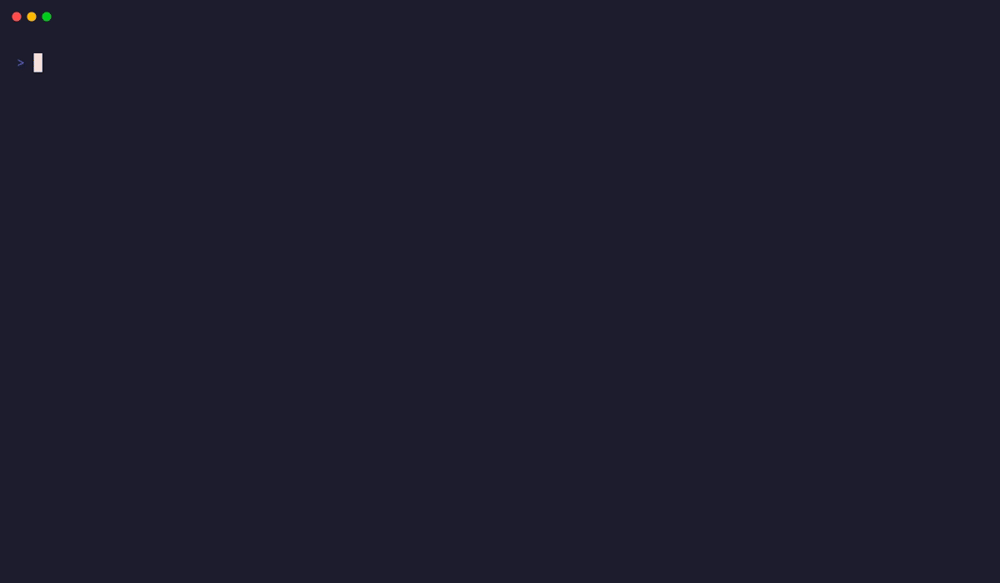

<a href="https://neurostack.sh"></a>

[](https://www.npmjs.com/package/neurostack)
[](https://pypi.org/project/neurostack/)
[](https://pypi.org/project/neurostack/)
[](https://github.com/raphasouthall/neurostack/actions/workflows/ci.yml)
[](LICENSE)
[](https://github.com/sponsors/raphasouthall)

**Your AI gets the right knowledge in 15 tokens, not 300.** NeuroStack is a local MCP server that indexes your existing Markdown vault and serves it to any AI agent with token-efficient tiered retrieval. It never touches your files. Works with [Claude Code](https://docs.anthropic.com/en/docs/claude-code/cli-usage), [Codex](https://developers.openai.com/codex/mcp/), [Gemini CLI](https://geminicli.com/docs/tools/mcp-server/), Cursor, Windsurf, or any MCP client.



## Get started

```bash
npm install -g neurostack
neurostack install
neurostack init
```

No prior config needed. No Python, git, or curl required - the npm package handles everything.

> **Lite mode** (~130 MB) works without a GPU or Ollama. **Full mode** (default, ~560 MB) adds semantic search and AI summaries via local [Ollama](https://ollama.ai).

## How it compares

| | NeuroStack | claude-mem | basic-memory | vestige |
|---|---|---|---|---|
| **Works with** | Any MCP client | Claude Code only | Claude Desktop, VS Code | Any MCP client |
| **Your vault files** | Never modified (read-only) | Not used (own DB) | AI writes to them | Not used (own DB) |
| **Indexes existing notes** | Yes - any Markdown folder | No - captures sessions | Yes - with write-back | No - own memory store |
| **Token-efficient retrieval** | Tiered: 15 → 75 → 300 tokens | Progressive disclosure | Full chunks | Full chunks |
| **Stale note detection** | Yes - flags misleading notes | No | No | Prediction error gating |
| **Use-dependent learning** | Hebbian co-occurrence boost | No | No | FSRS-6 spaced repetition |
| **License** | Apache-2.0 | AGPL-3.0 | MIT (core) | AGPL-3.0 |

**NeuroStack is for people who already have notes.** If you maintain a Markdown vault (Obsidian, Logseq, or plain files) and want your AI tools to search it intelligently without modifying anything, this is the tool. If you want auto-capture of AI sessions, use [claude-mem](https://github.com/thedotmack/claude-mem). If you want AI to write notes for you, use [basic-memory](https://github.com/basicmachines-co/basic-memory).

## Tiered retrieval

Most retrieval tools dump full document chunks (~300-750 tokens each) into your AI's context window. NeuroStack resolves 80% of queries at the cheapest tier:

| Tier | Tokens | What your AI gets | Example |
|------|--------|-------------------|---------|
| **Triples** | ~15 | Structured facts: `Alpha API → uses → PostgreSQL 16` | Quick lookups, factual questions |
| **Summaries** | ~75 | AI-generated note summary | "What is this project about?" |
| **Full content** | ~300 | Actual Markdown content | Deep dives, editing context |
| **Auto** | Varies | Starts at triples, escalates only if coverage is low | Default for most queries |

The result: lower API costs, less context window waste, and more of your AI's attention on actually answering your question.

## What it detects that others don't

**Stale notes.** When a note keeps appearing in search contexts where it doesn't belong, NeuroStack flags it. Your vault accumulates outdated information over time - old decisions, superseded specs, reversed conclusions. Without detection, your AI cites these stale notes confidently. NeuroStack catches them before they pollute results.

**Usage patterns.** Notes you retrieve together frequently get their connection weights strengthened automatically (Hebbian co-occurrence learning). The search graph learns your actual workflow, not just your file structure.



## Key features

### Search - find anything by meaning
- Hybrid semantic + keyword search with cross-encoder reranking
- Tiered retrieval with automatic cost escalation
- Topic clustering via Leiden community detection (GraphRAP)
- Workspace scoping - restrict queries to project subdirectories

### Maintain - stop citing outdated notes
- Stale note detection via prediction error monitoring
- Excitability decay - recent notes get priority, unused notes fade
- Auto-indexing - watches your vault for changes in the background

### Remember - persistent agent memory
- AI writes back observations, decisions, conventions, bugs
- Near-duplicate detection with merge support
- Session harvesting - extracts insights from Claude Code transcripts automatically
- Optional TTL for ephemeral memories

### Start fast - profession packs
Domain-specific templates, seed notes, and workflow guidance:

```bash
neurostack init                    # Interactive setup offers packs
neurostack scaffold devops         # Apply to existing vault
neurostack scaffold --list         # researcher, developer, writer, student, devops, data-scientist
```

## Use with any AI provider

NeuroStack is provider-agnostic. Add it to your MCP config:

```json
{
  "mcpServers": {
    "neurostack": {
      "command": "neurostack",
      "args": ["serve"],
      "env": {}
    }
  }
}
```

Or use the CLI standalone - pipe output into any LLM:

```bash
neurostack search "deployment checklist"
neurostack tiered "auth flow" --top-k 3
neurostack brief
neurostack search -w "work/" "query"    # Workspace scoping
neurostack --json search "query" | jq   # Machine-readable output
```

Setup guides: [Claude Code](https://docs.anthropic.com/en/docs/claude-code/cli-usage) · [Codex](https://developers.openai.com/codex/mcp/) · [Gemini CLI](https://geminicli.com/docs/tools/mcp-server/)

## Installation modes

| Mode | What you get | Size | GPU? |
|------|-------------|------|------|
| **lite** | FTS5 search, wiki-link graph, stale detection, MCP server | ~130 MB | No |
| **full** (default) | + semantic search, AI summaries, cross-encoder reranking | ~560 MB | No (CPU) |
| **community** | + GraphRAP topic clustering (Leiden algorithm) | ~575 MB | No |

```bash
neurostack install                           # Interactive mode selection
neurostack install --mode full --pull-models  # Non-interactive
```

<details>
<summary><strong>Alternative install methods</strong></summary>

```bash
# PyPI
pipx install neurostack
pip install neurostack                # inside a venv
uv tool install neurostack

# One-line script
curl -fsSL https://raw.githubusercontent.com/raphasouthall/neurostack/main/install.sh | bash

# Lite mode (no ML deps)
curl -fsSL https://raw.githubusercontent.com/raphasouthall/neurostack/main/install.sh | NEUROSTACK_MODE=lite bash
```

> On Ubuntu 23.04+, Debian 12+, Fedora 38+, bare `pip install` outside a venv is blocked by [PEP 668](https://peps.python.org/pep-0668/). Use `npm`, `pipx`, or `uv tool install`.

</details>

To uninstall:

```bash
neurostack uninstall
```

## Architecture

```
~/your-vault/                        # Your Markdown files (never modified)
~/.config/neurostack/config.toml     # Configuration
~/.local/share/neurostack/
    neurostack.db                    # SQLite + FTS5 knowledge graph
    sessions.db                      # Session transcript index
```

NeuroStack **never modifies your vault files**. All data - indexes, embeddings, memories, sessions - lives in its own SQLite databases.

## How the neuroscience works

Each core feature is modeled on a specific mechanism from memory neuroscience:

| Feature | What it does | Neuroscience basis |
|---------|-------------|-------------------|
| **Stale detection** | Flags notes appearing in wrong contexts | Prediction error signals trigger reconsolidation (Sinclair & Bhatt 2022) |
| **Excitability decay** | Recent notes get priority, old ones fade | CREB-elevated neurons preferentially join new memories (Han et al. 2007) |
| **Co-occurrence learning** | Notes retrieved together strengthen connections | Hebbian "fire together, wire together" plasticity |
| **Topic clusters** | Reveals thematic groups across your vault | Neural ensemble formation (Cai et al. 2016) |
| **Tiered retrieval** | Starts with key facts, escalates only when needed | Complementary learning systems (McClelland et al. 1995) |

Full citations: [docs/neuroscience-appendix.md](docs/neuroscience-appendix.md)

<details>
<summary><strong>All 16 MCP tools</strong></summary>

| Tool | What it does |
|------|-------------|
| `vault_search` | Search by meaning or keywords, with tiered depth |
| `vault_summary` | Pre-computed summary of any note |
| `vault_graph` | Note's neighborhood - what links to it and what it links to |
| `vault_triples` | Structured facts (who/what/how) extracted from notes |
| `vault_communities` | Big-picture questions across topic clusters |
| `vault_context` | Task-scoped context assembly for session recovery |
| `vault_stats` | Index health with excitability + memory stats |
| `vault_record_usage` | Track which notes are "hot" |
| `vault_prediction_errors` | Surface notes that need review |
| `vault_remember` | Store a memory (returns near-duplicate warnings + tag suggestions) |
| `vault_update_memory` | Update a memory in place |
| `vault_merge` | Merge two memories (unions tags, tracks audit trail) |
| `vault_forget` | Remove a memory by ID |
| `vault_memories` | List or search stored memories |
| `vault_harvest` | Extract insights from Claude Code session transcripts |
| `session_brief` | Compact briefing when starting a new session |

</details>

<details>
<summary><strong>Full CLI reference</strong></summary>

```
# Setup
neurostack install                    # Install/upgrade mode and Ollama models
neurostack init [path] -p researcher  # Interactive setup wizard
neurostack onboard ~/my-notes         # Onboard existing Markdown notes
neurostack scaffold researcher        # Apply a profession pack
neurostack update                     # Pull latest source + re-sync deps
neurostack uninstall                  # Complete removal

# Search & retrieval
neurostack search "query"             # Hybrid search
neurostack tiered "query"             # Tiered: triples -> summaries -> full
neurostack triples "query"            # Knowledge graph triples
neurostack summary "note.md"          # AI-generated note summary
neurostack communities query "topic"  # GraphRAP across topic clusters
neurostack context "task" --budget 2000  # Task-scoped context recovery

# Maintenance
neurostack index                      # Build/rebuild knowledge graph
neurostack watch                      # Auto-index on vault changes
neurostack decay                      # Excitability report
neurostack prediction-errors          # Stale note detection
neurostack backfill [summaries|triples|all]  # Fill gaps in AI data

# Memories
neurostack memories add "text" --type observation  # Store (--ttl 7d)
neurostack memories search "query"    # Search memories
neurostack memories list              # List all
neurostack memories update <id> --content "revised"  # Update in place
neurostack memories merge <target> <source>  # Merge two
neurostack memories forget <id>       # Remove
neurostack memories prune             # Remove expired

# Sessions
neurostack harvest --sessions 5       # Extract session insights
neurostack sessions search "query"    # Search transcripts
neurostack hooks install              # Hourly harvest timer

# Graph
neurostack graph "note.md"            # Wiki-link neighborhood
neurostack communities build          # Run Leiden detection

# Diagnostics
neurostack brief                      # Morning briefing
neurostack stats                      # Index health
neurostack doctor                     # Validate all subsystems
neurostack demo                       # Interactive demo with sample vault
```

</details>

## FAQ

**Does it modify my vault files?** No. All data lives in NeuroStack's own SQLite databases. Your Markdown files are strictly read-only.

**Do I need a GPU?** No. Lite mode has zero ML dependencies. Full mode uses PyTorch CPU and Ollama.

**How large a vault can it handle?** Tested with ~5,000 notes. FTS5 search stays fast at any size.

**Can I use it without MCP?** Yes. The CLI works standalone. Pipe output into any LLM.

## Requirements

- Linux or macOS
- **npm install**: Just Node.js - everything else is bootstrapped
- **Full mode**: [Ollama](https://ollama.ai) with `nomic-embed-text` and a summary model

## Get involved

- **Website**: [neurostack.sh](https://neurostack.sh)
- **Contributing**: [CONTRIBUTING.md](CONTRIBUTING.md)
- **Contact**: [hello@neurostack.sh](mailto:hello@neurostack.sh)
- **Sponsor**: [GitHub Sponsors](https://github.com/sponsors/raphasouthall) · [Buy me a coffee](https://buymeacoffee.com/raphasouthall)

## License

Apache-2.0 - see [LICENSE](LICENSE).

The optional `neurostack[community]` extra installs [leidenalg](https://github.com/vtraag/leidenalg) (GPL-3.0) and [python-igraph](https://github.com/igraph/python-igraph) (GPL-2.0+). These are isolated behind a runtime import guard and not installed by default.
